# WowHire - Decentralized Hiring Portal for Gig Workers

**WowHire** is a decentralized platform designed to revolutionize the gig economy by simplifying the hiring process and ensuring timely payment for gig workers. Built on Bitcoin and powered by BOB (Build On Bitcoin), HireWow abstracts the complexity of blockchain technology, making it easy for employees and gig workers to engage in efficient, secure, and trustless transactions.

## Achievements
- 🥈 **[2nd Place (BOB)](https://x.com/encodeclub/status/1856310925969813819)**

## Key Features

- **Simplified Onboarding**: Employers only need to purchase Bitcoin to get started. The rest is handled by BOB, which abstracts all the complexities of interacting with the blockchain.
- **Job Postings Made Easy**: The smart contract allows employers to create job postings, pick workers, and manage their workforce on demand.
- **Scalable Workforce**: Employers can scale their workforce as needed, whether expanding quickly for short-term projects or shrinking it as demands decrease.
- **Timely Payments**: Solves the problem of gig workers not being paid or facing delayed payments. Payments are handled securely through the BOB network, with the terms enforced by smart contracts.
- **Trustless Contracts**: HireWow uses decentralized smart contracts to manage job terms and payments, ensuring fairness for both employers and gig workers.

## How It Works

1. **Start with Bitcoin**: Employers simply buy Bitcoin to fund their HireWow account. This is the only requirement to get started.
2. **BOB Handles the Rest**: Once Bitcoin is acquired, BOB takes over, abstracting away the technical details.
3. **Smart Contracts for Jobs**: Employers can create job postings that detail the work required, deadlines, and payment terms. Gig workers can then apply for these jobs.
4. **Secure Payments**: Payments are locked into a smart contract, ensuring gig workers are paid as soon as the work is completed, eliminating the risk of non-payment or late payment.

## Benefits

- **For Employers**:

  - Quick and easy workforce management with the ability to scale on demand.
  - Transparent, trustless agreements with workers.
  - Lower overhead for managing payments and contracts.

- **For Gig Workers**:
  - No worries about delayed or missed payments.
  - Fair contracts, enforced by the blockchain.
  - Easy access to job opportunities from decentralized employers.

## Getting Started

1. **Create an Account** on HireWow and fund it with Bitcoin.
2. **Let us guide you** through the job posting process.
3. **Manage your workforce** with HireWow’s intuitive dashboard.

## To be continued

This project was started during the Encode Bangkok Bitcoin Hackathon. It was all built in the 24 hours allocated, while managing other events.
There are numerous technical improvements to be made in the future for the full fledged product, and this repository serves only as a proof of concept.

## License

HireWow is licensed under the MIT License.

# Contract

- CA: 0x020D4bf7b08aA7a5DBAa6a13C6a9D6083509Ff20
- Published and Verified: [bob-sepolia](https://bob-sepolia.explorer.gobob.xyz/address/0x020D4bf7b08aA7a5DBAa6a13C6a9D6083509Ff20?tab=contract_code)

# Flow & Example

## 1. Login with metamask

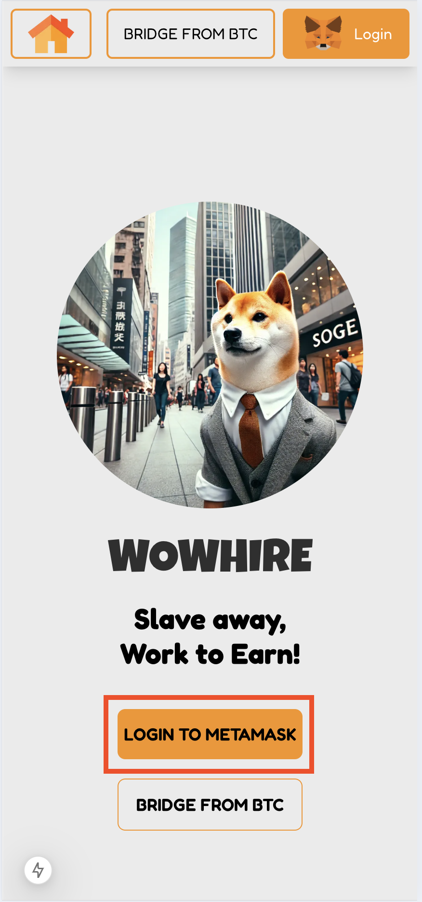

## 2. Choose Your Mode

For Hackathon user's will be able to choose if they would like to be a **Employer** or **Employee**.

## GET HIRED (Employee)

### Availability Form

- Employee can fill up details and pick a job type that is suitable for them.
- Employee will also be able to choose the time slot that is suitable for them.
  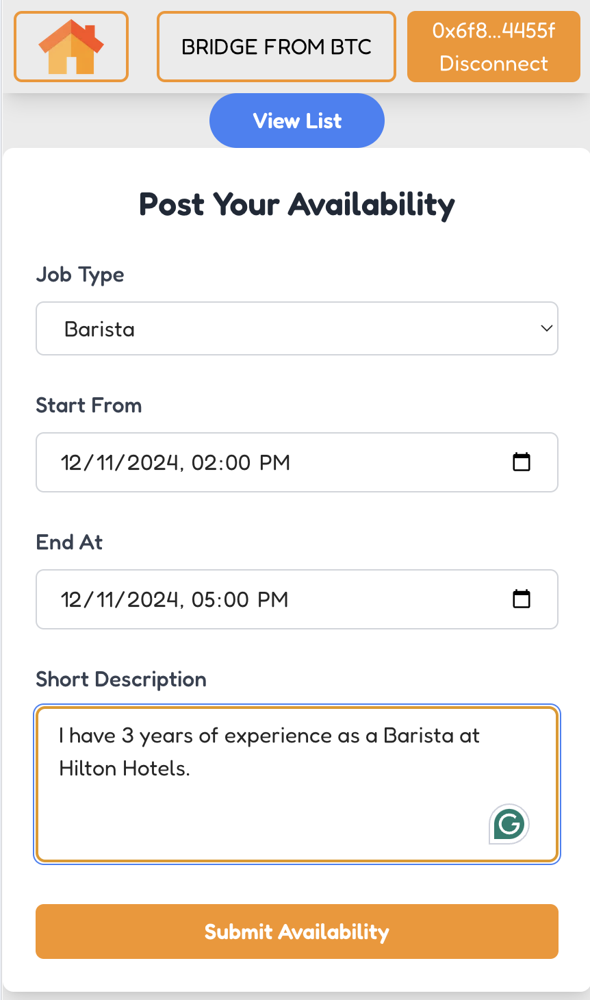

### Availability List

- Employee is able to view the lists of Job Availability that they've put up.
- If the Employee has been **Hired** for the Job, the employee may click on it to reveal their QR Code that they can use to click in to their job.

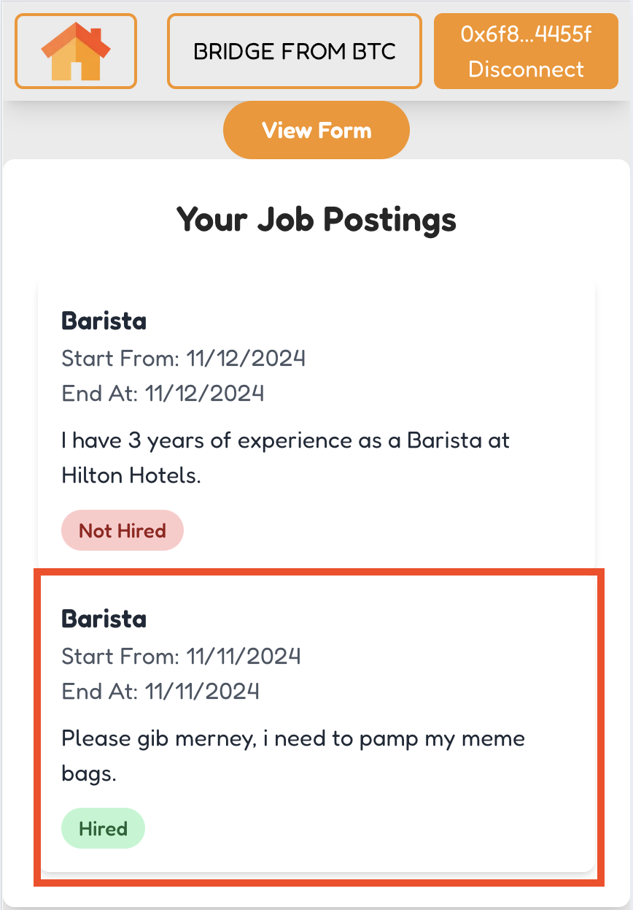

### Clock in with QR

- Show this QR to your Employer to start working!

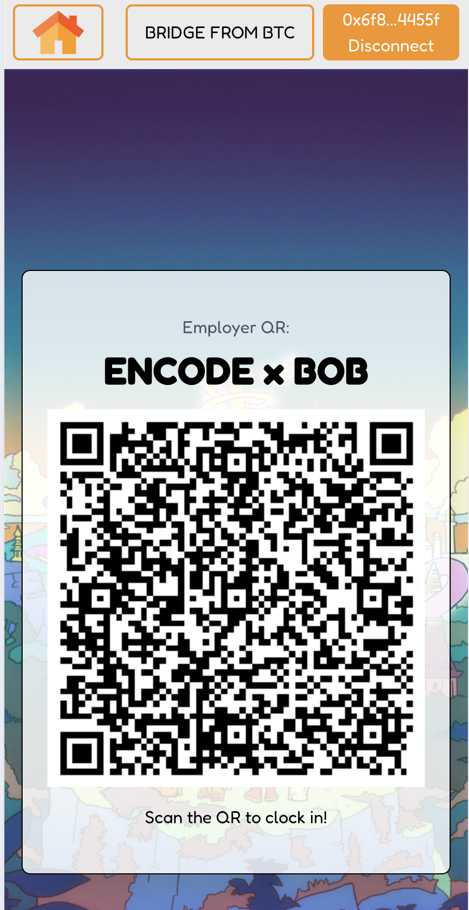

## HIRE SOMEONE (Employer)

- Employer is able to see a list of Job postings are able to select to add more Employee.

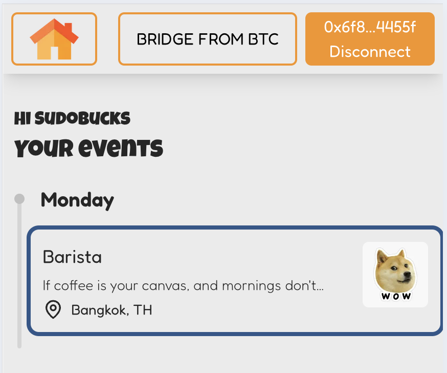

### Select Job

- There will be a timeslot that the Employer is able to see, who's working on which hour/shift
- If needed the Employer can click on `Add hire` to hire more Employees

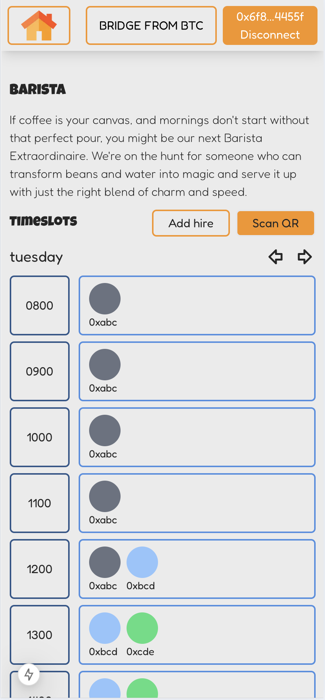

## Add Hire

- Select the time that date that the Employer would like to hire for.

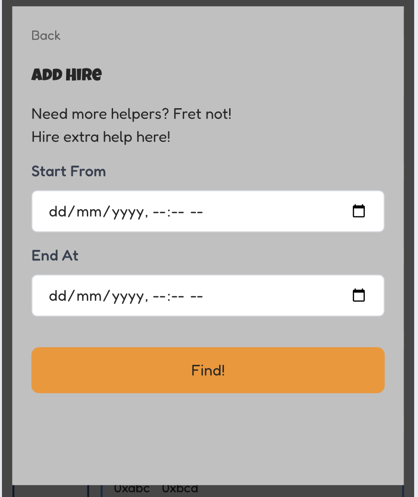

### View and Select available Employees.

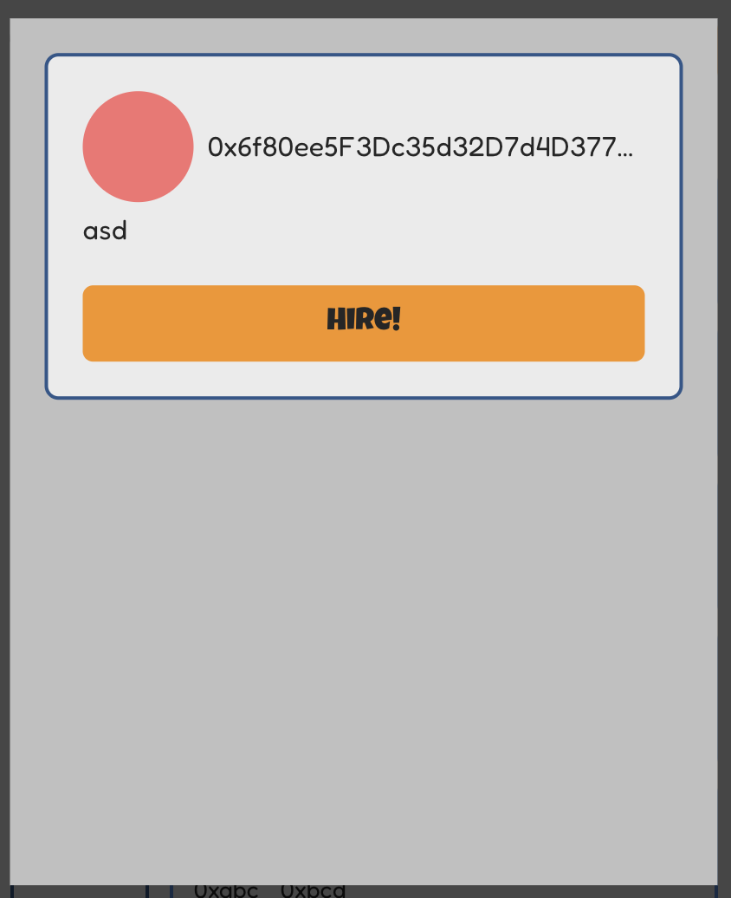

### Employee hired will appear on timeslots

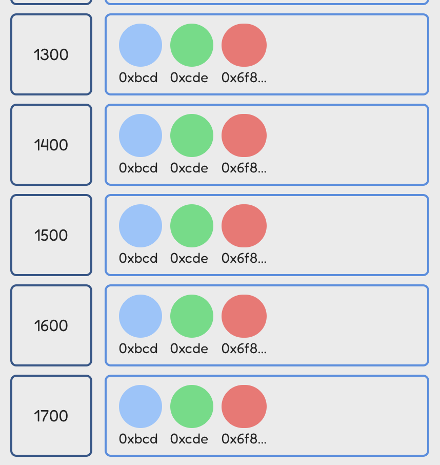

## Scan Employee QR

- Employer is able to scan Employees QR when they arrive to start the work!

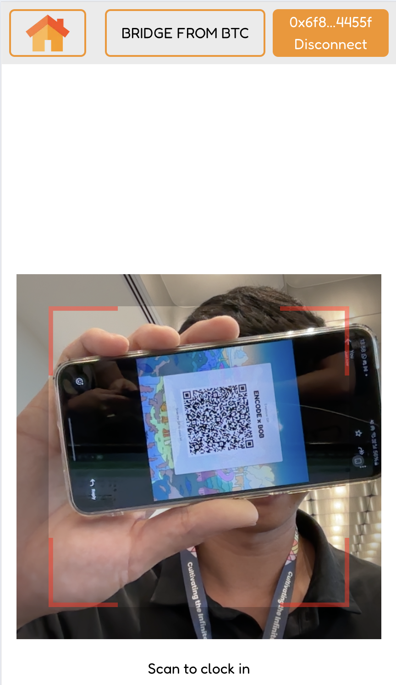

# START WORKING

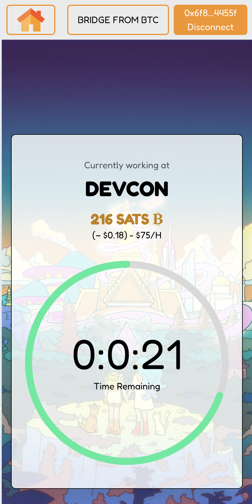
